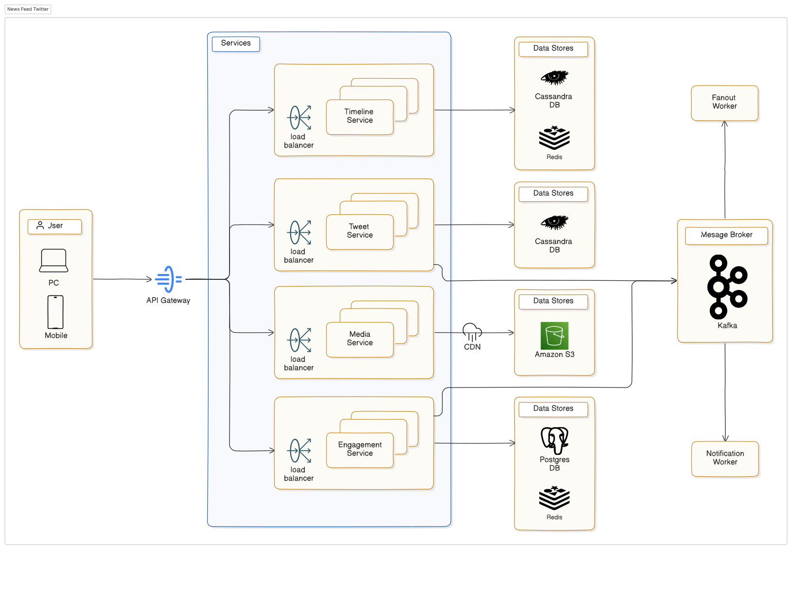

# 🎓 Mastering System Design  
*Build Scalable Systems, Master Architectural Patterns, and Ace System Design Interviews*  

---

## 📌 Overview  
This repository marks the completion of my **System Design Mastery Course** 🎉.  
Throughout this journey, I explored **real-world architectural challenges** and learned how to design **scalable, reliable, and high-performance systems** like those used by **Google, Netflix, Uber, Twitter, and Amazon**.

---

## 🚀 What I Learned  

### 🧠 **Core Concepts**
- **Scalability** – Horizontal vs Vertical scaling, Sharding, Partitioning  
- **Availability & Reliability** – Replication, Leader-Follower, Failover  
- **Performance Optimization** – Caching, CDNs, Database Indexing  
- **Microservices Architecture** – Service discovery, API Gateway, Load Balancing  
- **Consistency & CAP Theorem** – Strong, Eventual, and Causal consistency  
- **Event-Driven Systems** – Message Queues, Pub/Sub, Stream Processing  
- **Security & Observability** – Authentication, Rate limiting, Monitoring, Logging  

---

## 🏗️ **Systems I Designed**

| **#** | **System**           | **Key Concepts Learned** |
|-------|----------------------|---------------------------|
| 1️⃣ | **Search Engine**       | Inverted Index, Crawler, Ranking Algorithms, Distributed Storage |
| 2️⃣ | **Ticketing System**   | Schema Design, ACID vs Eventual Consistency, Payment Integration |
| 3️⃣ | **Cloud Storage**      | Object Storage, Block Storage, Metadata Service, CDN Integration |
| 4️⃣ | **Notification System** | Push & Pull Mechanisms, WebSockets, Pub/Sub, Retries & Backoff |
| 5️⃣ | **Real-Time Chat App** | WebRTC, Socket.io, Message Queues, End-to-End Encryption |
| 6️⃣ | **News Feed (Twitter)**| Fan-out on Write vs Read, Ranking, Caching, Eventual Consistency |
| 7️⃣ | **TinyURL**            | URL Hashing, Caching, High Availability, Rate Limiting |

---

## 🖼️ Real-World Case Studies (3x3 Grid)

  
  

  
  

  
  

  

---

## 🏆 Key Takeaways  

### ✅ Understand Core Principles
> Mastered scalability, availability, reliability, and performance for efficient system architectures.

### ✅ Design Scalable Systems  
> Hands-on experience with **load balancing**, **sharding**, **caching**, and **microservices** for high-performance applications.

### ✅ Apply Industry Best Practices  
> Learned proven strategies from **Google, Netflix, Meta, and Uber** to build robust and maintainable systems.

### ✅ Crack System Design Interviews  
> Developed a **structured framework** to solve system design problems and confidently handle interviews.

---

## 📚 Tech Stack & Tools  

**Languages:** Java · Python · Go · TypeScript  
**Databases:** MySQL · PostgreSQL · MongoDB · Redis · Cassandra  
**Messaging:** Kafka · RabbitMQ · Google Pub/Sub  
**Cloud:** AWS · GCP · Azure  
**Design Tools:** Mermaid · ReactFlow · Draw.io  

---

## 📌 Certificate  

---

## 🌟 Author  

**Hitesh Solanki**  
🚀 System Design Enthusiast | 💻 Software Developer | 🧠 Problem Solver  

---

## ⭐ Show Your Support  

If you found this repository helpful, don't forget to **star** ⭐ the repo and share it with others!  
