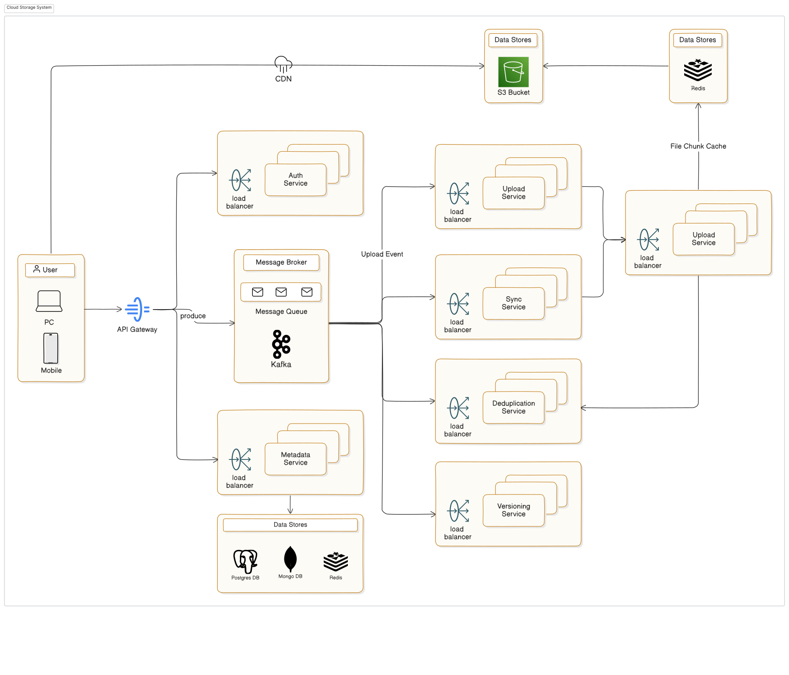

## Cloud Storage System

- Allows users to upload, store, and manage files of any type.
- Keeps files synchronized across devices (desktop, mobile, web).
- Enables secure sharing and collaboration with others.
- Handles massive scale (millions of users, petabytes of data).
- Maintains version history and supports file recovery.

## Architecture Overview

## Functional Requirements

- File Upload & Download: Users can upload files of any type and retrieve them on-demand.
- Multi-Device Sync: Automatically sync files across web, mobile, and desktop clients.
- File Organization: Support folders, nested directories, and tagging.
- Sharing & Collaboration: Public/private links, editable access, shared folders.
- File Versioning: Maintain previous versions and allow rollback.
- Soft Delete & Restore: Trash bin with restore option before permanent deletion.

🔍 Focus on features that users expect from platforms like Google Drive or Dropbox.

## Non-Functional Requirements

- Scalability: Must support millions of users and petabytes of data.
- High Availability & Durability: 99.999999999% durability (aka “eleven nines”) for files.
- Low Latency: Fast uploads/downloads for small & large files.
- Security: End-to-end encryption, secure sharing, access control.
- Cost Efficiency: Optimize storage and bandwidth usage.
- Observability & Monitoring: Track usage, errors, sync delays, API failures.

⚠️ These qualities shape your architectural choices and trade-offs later.

## Assumptions and Constraints

Key Assumptions (impacting architecture):

- Files can be large (up to 5 GB) → requires chunked uploads
- Users access from multiple devices → real-time sync essential
- Cloud object storage will be used → separation of metadata & file content
- Authentication & user identity is handled externally → we focus on storage layer

Core Constraints (that shape the system):

- Uploads must be resumable → chunk tracking, session management
- File sync latency < 5 seconds → event-driven updates, push mechanisms
- Storage must be cost-efficient → deduplication & lifecycle policies
- Fine-grained access control required → permission model and ACL support

## Estimating Scale – Users, Listings, and Bookings

Key Metrics (Initial + Growth Projections):

- Users: 10M active users
- Average files/user: 500
- Total stored files: ~5B
- Average file size: 2MB
- Total data stored: ~10PB
- Upload rate: ~2K uploads/sec (peak)
- Sync events: ~10K updates/sec (peak)

Implication:

- Scale requires object storage for durability, distributed metadata service, and horizontal scalability in sync and notification pipelines.

## Understanding Access Patterns

Write-heavy:

- Uploads = large payloads (chunked)
- Frequent sync updates
- Versioning = multiple writes per file

Read-heavy:

- Downloads from multiple devices
- Folder listings & metadata reads
- Shared link previews

Implication:

- Must optimize both file write flow (chunking, session mgmt) and metadata read flow (low-latency access, caching).

## Identifying System Bottlenecks and Challenges

- Single metadata DB → becomes a hotspot
- Large file uploads → risk of failure, timeouts
- Real-time sync → must avoid stale states, race conditions
- Permission checks → slow file/folder access
- High volume shared links → unauthenticated access traffic
- Implication: Push toward partitioned metadata, chunked resumable uploads, pub-sub sync, caching for shared/public content.

## Major Components in Our Cloud Storage System

- Upload Service: Handles chunked/resumable uploads
- Metadata Service: Stores file structure, permissions, ownership
- Auth Service: Validates permissions for all operations
- Sync Service: Pushes changes to connected devices in near real-time
- Storage Service: Interfaces with cloud object storage
- Deduplication Service: Eliminates redundant file chunks
- Versioning Service: Manages previous versions and deleted files

## API Design Overview

Upload & File Management

- POST /upload/initiate → Starts a new file upload session and returns an Upload ID
- PUT /upload/{id}/chunk → Uploads a chunk for the given Upload ID
- POST /upload/{id}/complete → Finalizes upload, assembles file, triggers post-processing

File Retrieval & Metadata

- GET /files/{fileId} → Downloads the file with access control checks
- GET /files/{fileId}/metadata → Fetches file metadata, version history, permissions

Sharing & Collaboration

- POST /files/{fileId}/share → Creates a shareable link (public/private)
- GET /files/shared/{token} → Access file via shared link (unauthenticated access)

Sync & Change Tracking

- GET /sync/updates → Streams or polls for real-time file/folder changes

✅ All APIs are secured, support idempotency, and follow RESTful principles. Uploads are resumable. Metadata is separate from file content.

## How Services Communicate

Patterns Used:

- REST + gRPC APIs for synchronous communication
- Pub/Sub or message queues for:
- Change events (for sync)
- Post-upload processing

Event sourcing for sync and versioning triggers

- Real-time needs → WebSockets or long polling to push file updates

## Handling Chunking for Large Files

Why Chunking?

- Efficient upload for large files
- Resumable uploads to prevent data loss
- Parallel uploads for faster transfers

How We Handle Chunking:

- Split files into manageable chunks (e.g., 5MB per chunk)
- Each chunk is independently uploaded (with its own checksum)
- Chunk metadata is tracked in the Metadata Service (upload progress, chunk ID)
- After all chunks are uploaded, they are assembled into a single file in the Storage Service

Chunk Management:

- Retries if a chunk fails during upload
- Error handling: If upload is interrupted, resume from the last successful chunk

## Versioning for File Updates

Why Versioning?

- Preserve historical file states for rollback
- Allow users to track changes and restore previous versions

How We Handle Versioning:

- File metadata stores version information (timestamps, versions)
- Each file update triggers a new version entry in the Metadata Service
- Version IDs for easy access to specific versions
- Users can restore any version via a simple API call (GET /files/{fileId}/version/{versionId})

Versioning Workflow:

- A new file upload will generate a new version if file content differs from previous
- Change detection: Compare chunks or file hashes to detect if file has changed

## Storage Strategy

Object Storage:

- Store files as chunks for efficient uploads, parallelism, and resilience.
- Ensure data replication for redundancy and availability.

SQL vs. NoSQL for Metadata:

- SQL for structured metadata (user data, permissions, file details).
- NoSQL for flexible or dynamic metadata (logs, dynamic file attributes).

Scalability & Fault Tolerance:

- Object storage offers horizontal scalability.
- NoSQL for fast scaling of unstructured data

## Caching Strategy

- Metadata Caching: Use in-memory caches for fast access to metadata.
- File Content Caching: Cache files at edge locations via a CDN for quick retrieval.
- Sync & Consistency: Use event systems (e.g., queues) for real-time sync and cache invalidation.

## Database Schema (Rough Overview)

- User Management: SQL for structured user data and relationships.
- File Metadata: SQL for structured metadata, NoSQL for flexible or dynamic attributes.
- Chunk Tracking: NoSQL for chunk metadata tracking.
- File Versions: SQL for relational versioning, NoSQL for scalable versioning.
- Permissions: SQL for managing access control (read/write).
- Audit Logging: SQL for structured logs, NoSQL for high-volume logs.

## Strategic Tech & Infra Decisions

- Architecture: Microservices, Containers (Docker, Kubernetes)
- Storage: Object Storage for file chunks (e.g., S3, MinIO)
- Database: SQL (PostgreSQL) for structured metadata. NoSQL (MongoDB) for scalable metadata.
- Caching: In-memory caching (e.g., Redis), CDN for content delivery
- API Gateway: For request routing, security (e.g., Kong, NGINX)
- Auto-Scaling: Dynamic scaling based on load
