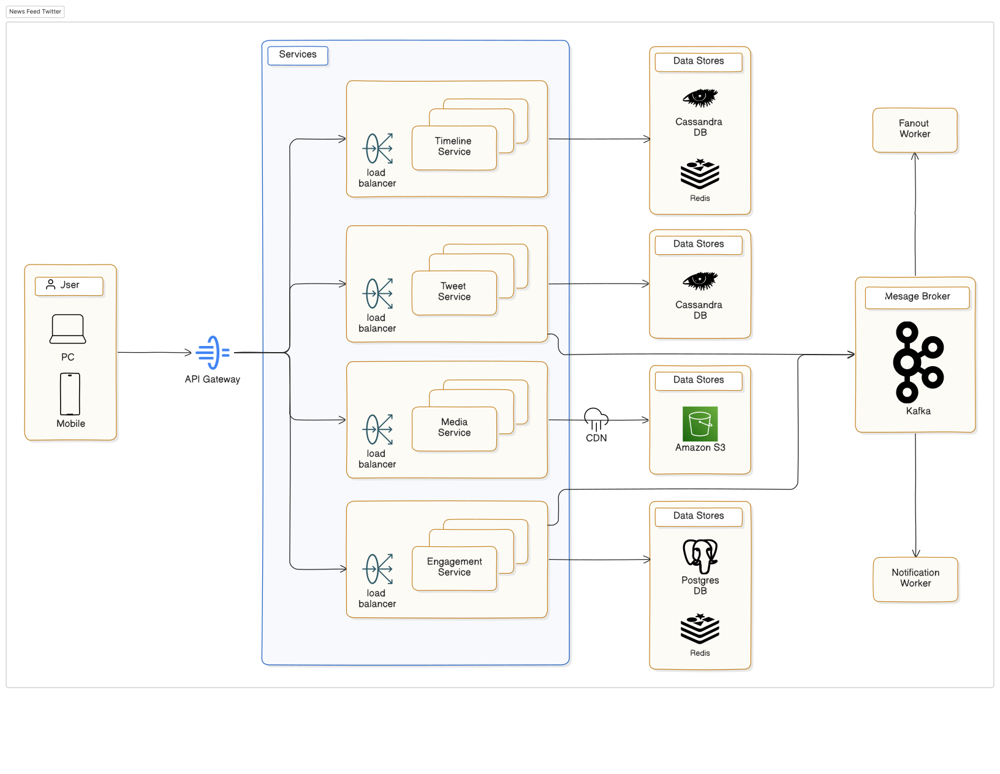

## News Feed Twitter

A timeline of updates/posts from people you follow. Core in platforms like Twitter,
Instagram, Facebook.

## Architecture Overview

## Core Functional Requirements

- Post a tweet/update.
- Follow/unfollow users.
- View home timeline.
- Timeline must show updates from followed users.
- Likes, replies, retweets
- Media uploads (images, videos)
- Interaction Flow (User Perspective):
  - Alice follows Bob.
  - Bob tweets “Hello World”.
  - Alice opens app → sees Bob’s tweet instantly.

## Non-Functional Requirements

- Timeline expectations:
  -- Feeds load instantly
  -- New posts appear in real-time
  -- Feed is relevant & fresh
  -- Posts are not missing or duplicated
- High Availability
- Low Latency
- Scalability

## Constraints & Challenges

Fan-In / Fan-Out Challenge

- 1 user → 1 tweet → must reach 1M followers?
- Should we push to all followers? Or pull on demand?

💡 Fan-out on write vs. Fan-out on read — this will shape our entire design.

## Estimating Scale & Identifying Bottlenecks

- Daily Load Estimates:
  -- 500M total users | 200M DAU
  -- ~1B tweets/day | ~300M media uploads
  -- ~1B likes, 500M replies, 250M retweets
  -- 2B+ feed requests/day (10 opens/user)
  📉 Read > Write: ~80% traffic is read-heavy
- Media Storage & Delivery
- ~300M media uploads/day = 100–500TB/day
- Must support:
- Upload APIs
- Object Storage (S3, GCS)
- CDN-backed delivery
- Tweet ↔ media linking

## Identifying System Bottlenecks and Challenges

- Timeline = Fan-out at Scale
  -- 1 user tweets → needs to be visible to 1M followers
  -- Fan-out Models:
- Fan-out on write: Pre-compute timelines (fast reads, heavy writes)
- Fan-out on read: Compose timeline at read time (slower reads, lighter writes)

- Hot users (celebrities) can trigger write storms
- Read & Write Amplification
  -- Write-Intensive Actions
- Posting a tweet: May fan out to 100s or millions of timelines
- Retweets, replies, likes: Update multiple engagement counters and visibility
- Media uploads: Chunked writes, storage, and metadata association
- Read-Heavy Patterns
- Opening the timeline: Aggregates and sorts tweets from 100s of followed users
- Viewing a tweet: Triggers fetches for media, replies, likes, retweets
- Scrolling: Causes pagination, cache lookups, and lazy loads

One user action can trigger multiple backend reads/writes across services.

## Core Services Breakdown

- User Service – Profile, follow/unfollow
- Tweet Service – Create, retrieve tweets
- Timeline Service – Compose timelines for users
- Engagement Service – Likes, replies, retweets
- Media Service – Upload, store, fetch media
- Notification Service – Fan-out alerts, activity
- Fanout Worker – Background timeline propagation

## Timeline Generation Strategy

- Fan-out on Write
  -- → Pre-compute timelines when a user tweets
  -- Fast reads, heavy writes for hot users
- Fan-out on Read
  -- → Compose timeline on demand from followed users
  -- Lighter writes, slower reads
- Hybrid Model = best of both:
  -- Fan-out to regular users
  -- Read-time fetch for hot users

## Sync vs. Async Communication

Synchronous (API Calls):

- Fetch user timeline
- Get tweet details
- Submit engagement
  Asynchronous (Event Queues):
- New tweet → enqueue fan-out jobs
- Media uploads → process & link
- Engagement → push notification trigger

Improves throughput, decouples latency-sensitive paths
