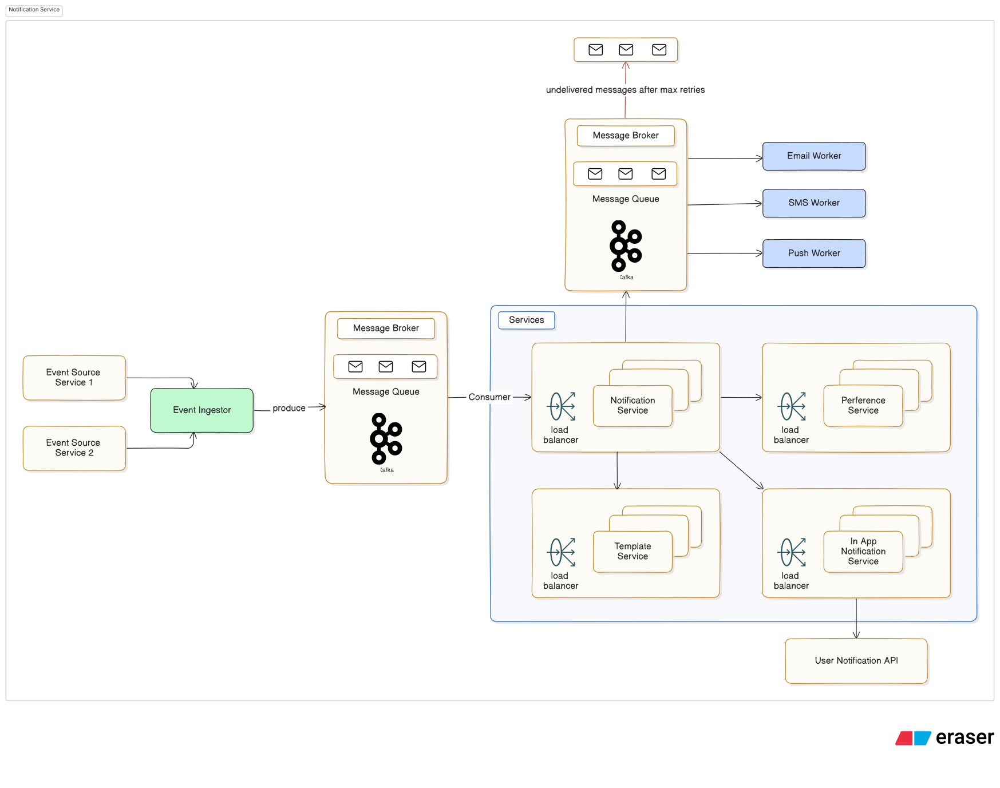

## Notification System

We need to build a Notification System that delivers messages to users
across multiple channels in a reliable, scalable, and user-respectful way.

The system should support:

- Event-triggered notifications (e.g., new message, order shipped)
- Multiple delivery channels (Email, SMS, Push, In-App)
- User-level notification preferences
- Template-based, translatable messages
- Retry logic and delivery guarantees

## Architecture Overview

## Functional Requirements

- Accept events from multiple upstream sources (e.g., order service, auth service)
- Trigger one or more notifications per event
- Support for delivery channels: Email, SMS, Push Notification, In-App
- Store and enforce user preferences for notification types and channels
- Template-based message generation with localization support
- Implement retry logic and dead-letter handling for failed messages
- Expose APIs for sending custom notifications and managing preferences

## Non-Functional Requirements

- Scalability: Handle millions of notifications/day, burst traffic at peak
- Reliability: Guarantee at-least-once delivery, avoid duplicates
- Low Latency: Notifications should be near real-time (< few seconds)
- Security: Encrypt sensitive data, secure APIs, role-based access
- Extensibility: Add new channels and templates with minimal changes
- Observability: Logs, metrics, traceability for audits and debugging
- Idempotency for safely retrying failed deliveries

## Constraints & Challenges

Channel Limitations:

- SMS/email providers have rate limits & SLAs
- Push delivery can be unreliable (app not installed, permissions off)

Event Burst Handling:

- Spikes during flash sales, releases, or system-wide events
- Queue buildup & backpressure risks

User Preference Complexity:

- Granular preferences (per event type, per channel)
- Quiet hours & regional compliance (e.g., GDPR, DND rules)

Latency Expectations:

- Users expect "instant" feedback — latency must be low but not at the cost of reliability

Retry & Idempotency:

- Retries can cause duplicate messages if not handled idempotently
- Failed external provider calls must not block the whole system

Security & Privacy:

- PII like emails and phone numbers must be securely stored & transmitted
- Must log activity without leaking sensitive content

## Estimating Scale

- Active users/day: 10 million
- Average events/user/day: 5
- Notification fan-out per event: 2 channels (e.g., Email + Push)
- Total notifications/day: 10M _ 5 _ 2 = 100M
- Peak traffic multiplier: 3x (flash sales, incidents)
- Why Estimate Scale?
  -- Scale drives architecture choices — what works for 1K users might break at 1M
  -- Helps identify bottlenecks early, before we design a brittle system
  -- Informs resource allocation and cost estimates (infra, third-party services)
  -- Assists in setting up proper load testing, alerting, and autoscaling

## Identifying System Bottlenecks and Challenges

- Event Ingestion: High volume of incoming events → need rate-limiting, buffering (Kafka, SQS, etc.)
- Template Rendering: CPU-heavy if synchronous; use caching or pre-rendering
- External Provider APIs: Latency and rate-limited — risk of throttling and timeouts
- User Preference Lookup: High QPS reads; might need caching layer (e.g., Redis)
- Monitoring & Logging: High cardinality data → risk of overwhelming observability stack
- Delivery Channel Characteristics:
  -- SMS is the most expensive & regulated.
  -- SMS cost spikes drastically with volume
  -- Push depends on mobile infra (e.g., Firebase, APNs).
  -- In-App can be fast but assumes user is online in the app.
  -- Cloud provider API calls (SES, Twilio, Firebase)
  -- High-availability infra (queues, load balancers, workers)

## Key components

Event Ingestor

- Captures events from upstream services (e.g., Order Service, Auth Service).
- Uses rate-limiting and buffering (e.g., Kafka, SQS) to handle high volume.

Notification Orchestrator

- Decides which notifications to trigger based on event and user preferences.
- Coordinates with Preference Service and Template Service.

Preference Service

- Stores user notification preferences (channels, event types, quiet hours).
- Uses caching (e.g., Redis) for fast access.

Template Service

- Generates localized messages based on event data.
- Caches templates for performance.

Channel Workers (Email, SMS, Push, In-App)

- Handles delivery via dedicated workers for each channel.
- Manages retries and failures.

Delivery Tracker / Dead-letter Queue

- Tracks delivery status and handles failed messages.
- Uses dead-letter queue for undelivered messages after retries.

## Strategic Tech & Infra Decisions

Tech Stack Choices

- Message Broker: Kafka (high-throughput) or Amazon SQS (managed service)
- Template Rendering: Handlebars or Liquid templating engine
- Notification Channels: SendGrid (Email), Twilio (SMS), Firebase FCM (Push)

Infra & Deployment

- Deployment: Microservices on Kubernetes or AWS Lambda (serverless)
- Scaling: Horizontal Pod Autoscaling or Keda for scaling workers
- Persistence: PostgreSQL for preferences, S3 for template storage

Security & Observability

- Security: JWT auth, RBAC for admin APIs
- Observability: Prometheus + Grafana for monitoring, CloudWatch for logs
