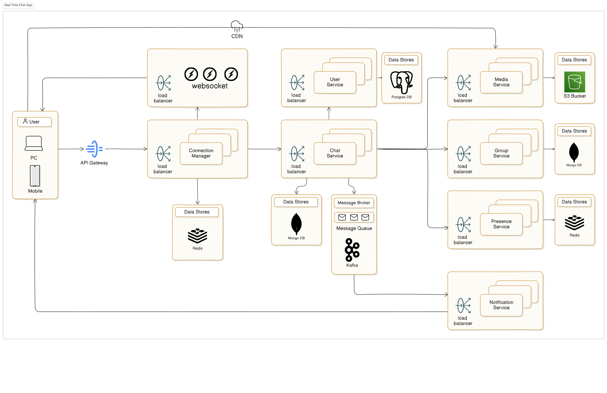

## Real-Time Chat Application

Designing a real-time chat application like WhatsApp.

## Architecture Overview

## Functional Requirements

- 1-to-1 and group messaging
- Typing indicators and online status
- Media support (images, videos, documents)
- Delivery and read receipts
- Multi-device support with sync

## Non-Functional Requirements

- Sub-second message delivery
- High availability & fault tolerance
- End-to-end encryption
- Scalable to millions of users
- Smooth UX even on poor networks

## Constraints & Challenges

- Message Ordering & Delivery Guarantees: Ensure no duplicates, no lost messages, and correct order, even under retries or reconnections.
- Unreliable Networks: Mobile users may frequently disconnect; we need robust retry, buffering, and sync mechanisms.
- Security & Privacy: End-to-end encryption must be seamless, with no access to message content by servers.
- Latency Expectations: Sub-second message delivery is expected, regardless of load or geography.
- Presence & Sync: Track who's online and sync message state across all devices in near real-time.
- High Scale: Millions of concurrent users, chatrooms, and messages per second; we must scale horizontally and efficiently.

## Estimating Scale

We begin with a few rough assumptions to get a sense of expected load:

- Active users/day: 100 million
- Average messages/user/day: 50
- Messages/day: 100M × 50 = 5 billion messages/day
- Peak traffic multiplier: 3× during global events
- Concurrent connections: 20–30 million users online at peak

## Identifying System Bottlenecks and Challenges

Message Ingestion & Fanout

- Fanout to multiple recipients or devices causes exponential delivery load
- Must queue, buffer, and batch smartly (e.g., Kafka, Redis Streams)

Presence Updates

- Real-time online/offline tracking is chatty and high frequency
- Use Pub/Sub patterns and efficient TTL-based caching

Delivery Acknowledgments

- Each sent/read receipt adds more writes — can overload databases
- Needs fast, write-optimized storage like Cassandra or DynamoDB

Sync Across Devices

- Every message must sync across all logged-in devices
- Requires a device registry and smart deduplication

Storage & Retrieval

- Billions of messages stored with search capability
- Must partition smartly and use append-friendly stores

Encryption & Security

- End-to-end encryption adds CPU cost and complexity
- Key exchange and secure metadata handling must scale too

## Key Bottleneck: Real-Time Delivery (WebSockets)

- Real-time delivery is fundamental to chat systems — users expect messages to
  appear instantly. This means:
- Persistent connections need to be maintained for millions of users using WebSockets
- Load balancers and application servers must handle long-lived connections
- Need for connection management service: track connected users, devices, and routing
- Risk: connection churn, network drops, or mobile limitations (e.g., background app states)
- Why it’s a bottleneck: Handling millions of concurrent WebSocket connections requires optimized infra, horizontal scaling, and careful connection lifecycle management

## High-Level Architecture Overview and Key components

- Connection Manager (WebSocket Service): Manages persistent WebSocket connections, delivers real-time messages, and tracks user/device sessions.
- Chat Service: Core business logic for sending, receiving, storing messages, and managing delivery status and history.
- Presence Service: Tracks online/offline status, typing indicators, and syncs across user devices using pub-sub or Redis.
- Notification Service: Handles fallback notifications (e.g., push, SMS) when recipients areoffline or WebSocket delivery fails.
- Media Service: Manages upload and retrieval of media files like images, videos, and attachments using object storage.
- Auth & User Service: Responsible for authentication, user profile management, and device binding.
- Storage Layer: Backing stores for messages, presence, media metadata, and delivery receipts — optimized for high write throughput.
- Group Service: Group Management: Handles group creation, deletion, and membership management (add/remove users).

## Real-Time Connection Manager (WebSocket Service)

- Maintains long-lived WebSocket connections per user and device.
- Handles message routing between senders and recipients.
- Integrates with Presence and Chat services for sync and state management.
- Supports scale-out using sticky sessions, Redis pub-sub, or message queues.
- Ensures delivery acknowledgments, retries, and device-level delivery tracking.

## How Chat & Group Chat Services Use Connection Manager for Real-Time Messaging

Direct Chat:

- Sender sends a message to the Chat Service with the recipient's user ID.
- The Chat Service then sends the message to the Connection Manager.
- Connection Manager looks up the recipient's active WebSocket connection and forwards
- the message to the corresponding WebSocket server.
- The Receiver receives the message in real-time.

Group Chat:

- Sender sends a message to the Group Chat Service with the group ID and message content.
- The Group Chat Service queries the Connection Manager, which looks up all active WebSocket connections for users in that group via the Group Members table.
- The Connection Manager forwards the message to all group members' active WebSocket connections.
- All group members receive the message simultaneously.

## API Design – WebSocket + REST

WebSocket Communication (Real-Time)

- connect: Initiates persistent connection with access token and user metadata.
- send_message: JSON payload with recipient ID, message content, timestamp, type.
- message_ack: Acknowledgment from client upon delivery/read.
- typing_indicator: Optional message indicating typing state.

REST APIs (Non-Real-Time Needs)

- GET /messages?userId=&conversationId=
- Fetch historical messages with pagination and filters.
- POST /media/uploadUpload image/video/audio
- attachments and get media URL.
- GET /presence/{userId}
- Fetch last seen / online status for a user.
- POST /feedback
- S ubmit crash reports or feedback (optional).

Security

- All requests (WebSocket handshake + REST) require JWT auth.
- Role-based access for user vs. admin endpoints.

## Strategic Tech & Infra Decisions

Tech Stack Choices:

- Message Broker: Kafka (high-throughput) or AWS SQS (managed service)
- Real-time Communication: WebSockets for instant messaging, leveraging SignalR (for .NET) or similar frameworks
- Notification System: Firebase Cloud Messaging (FCM) for push notifications
- Database: NoSQL databases (e.g., MongoDB) for fast reads and flexible schema

Infrastructure & Deployment:

- Deployment: Microservices on Kubernetes for scalability and management
- Scaling: Horizontal scaling for WebSocket connections; KEDA (Kubernetes Event-Driven Autoscaling) for auto-scaling workers
- Storage: Redis for caching active user sessions, PostgreSQL for transactional data (e.g., user settings)

Security & Observability:

- Authentication: OAuth2 for secure authentication across platforms
- Logging & Monitoring: Prometheus and Grafana for real-time monitoring; CloudWatch for logs and alerts
- High Availability: Multi-region deployment for failover; load balancing across WebSocket servers
