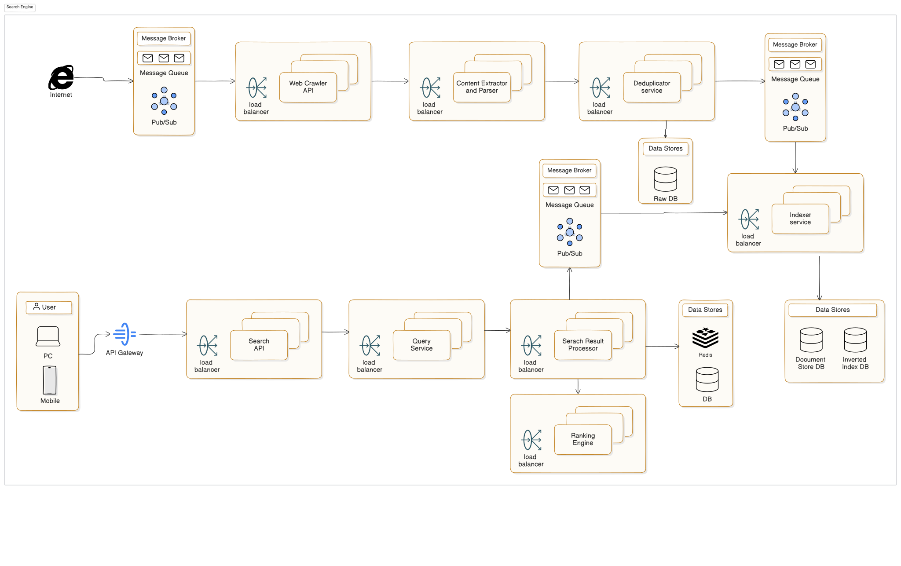

## Search Engine (aka Google)

- Crawl and index billions of web pages
- Serve keyword-based queries
- Return relevant, ranked results in real-time
- Update the index periodically for freshness
- General users performing web searches
- Internal analytics teams querying data

## Architecture Overview

## Functional Requirements

- Web Crawling : Discover and fetch web pages at scale
- Indexing : Extract text, normalize, and structure for fast querying
- Keyword Search: Accept queries and return relevant documents
- Ranking: Score and sort results by relevance
- Re-indexing: Periodically re-crawl for updated/fresh content

## Non-Functional Requirements

- Performance: < 200ms query response time
- Scalability: Index billions of documents, handle 50K QPS
- Freshness: Update index with recent changes in hours
- Fault Tolerance: No single point of failure; retry on fetch failure
- Storage Efficiency: Compress and deduplicate massive data volumes

## Key System Design Challenges

- Crawling the Web: How to avoid duplication and rate limits?
- Indexing: How to store & search through billions of documents fast?
- Relevance: How to rank results in a meaningful way?
- Scaling: How to scale search infra as usage and index size grow?
- Freshness vs. Cost: How often should we re-crawl?

## Assumptions and Constraints

Assumptions:

- We’re focusing on publicly accessible websites (no login or dynamic JS-heavy pages).
- Crawlers will respect robots.txt and politeness policies.
- Query language is limited to simple keyword searches.
- Ranking will be based on basic relevance models (TF-IDF, PageRank).
- Users expect instantaneous results (<200ms) for top N results (e.g., 10–20).

Constraints:

- Limited bandwidth for crawling — need scheduling and deduplication.
- Storage and indexing must handle petabyte-scale data.
- Real-time indexing not required — periodic batches acceptable.
- No personalization or user profiling in this phase.
- Distributed systems complexity — must handle node failures, retries, and horizontal scaling.

## Estimating Web Scale

- Total indexed pages: ~100+ billion
- Average page size: ~100 KB
- Storage required: ~10 PB (raw), ~2–3 PB (compressed)
- Daily searches: 5–10 billion (global search engines)
- Target for MVP: 100M pages, 1M QPS capacity, 1PB storage budget

## Traffic & Query Load Estimation

Assumptions:

- 10M active users
- 5 queries/user/day = 50M queries/day
- Peak QPS = ~1000–2000 (with burst handling)

Query Pattern:

- 95% read (search queries)
- 5% write (crawling/indexing updates)

## Index Size & Storage Estimation

- Raw HTML content: ~100M pages × 100KB = ~10 TB
- Processed & tokenized content: ~3–5 TB
- Inverted index (terms → doc IDs): ~500–800 GB
- Forward index (doc ID → content): ~5 TB
- Metadata (titles, links, ranks): ~100–200 GB

## Query Latency Expectations

- Query parsing: < 5ms
- Index lookup: < 20ms
- Ranking & scoring: < 50ms
- Result formatting: < 10ms
- Total SLA: < 200ms end-to-end

## Identifying Key Bottlenecks

Crawling Layer:

- Bandwidth limitations & site rate limits
- Risk of duplicate content
- ➤ Solution: Distributed crawling, deduplication filters, crawl scheduling, robots.txt adherence

Indexing Layer:

- High memory & disk I/O usage when processing large datasets
- ➤ Solution: Segment-based indexing, compression (e.g., delta encoding, front-coding)

Query Layer:

- High QPS can cause latency spikes
- ➤ Solution: Sharded inverted indexes, result caching (popular queries), fast in-memory lookups

Storage Layer:

- Petabyte-scale storage requirement (raw + indexed data)
- ➤ Solution: Use distributed file systems (e.g., HDFS, S3), columnar formats, cold/hot storage separation

Freshness Challenge:

- Web content changes frequently — need efficient re-crawling
- ➤ Solution: Prioritize high-change-rate sites, adaptive re-crawling intervals, content diffing
- ➤ Solution: Prioritize high-change-rate sites, adaptive re-crawling intervals, content diffing

## Scale-Driven Design Decisions

- Sharded architecture for inverted index
- Use forward & inverted indexes for speed and relevance
- Crawler partitioning by domain hash
- Replication for fault tolerance
- Introduce caching for frequent queries

## Core Components of the Search Engine

- Web Crawler Service: Continuously fetches and downloads web pages from the internet, respecting crawl policies and rate limits.
- URL Frontier & Scheduler: Manages the queue of URLs to be crawled, prioritizes based on freshness, domain policies, and crawl history.
- Content Extractor & Parser: Cleans HTML, extracts visible text, metadata, and outgoing links for further processing.
- Indexer Service: Tokenizes, stems, and builds both forward and inverted indexes from parsed content.
- Document Store: Stores raw and parsed versions of crawled web pages along with metadata (titles, crawl date, etc.).
- Inverted Index Store: Maps search terms (tokens) to lists of documents (docIDs) that contain them, enabling fast lookups.
- Query Service: Parses incoming search queries, looks up inverted index, fetches candidate documents.
- Ranking Engine: Scores candidate documents using ranking algorithms like TF-IDF, PageRank, and freshness relevance.
- Search API: Exposes a user-facing interface (or internal API) to handle search requests and return ranked results.
- Cache & Frontend: Stores hot query results in-memory (e.g., Redis) and provides the UI or API gateway to users.

## Crawler Coordination Architecture

Crawler Flow:

- URL Frontier: Queue of URLs to visit (distributed, prioritized)
- Crawler Workers:
- Fetch pages (respecting robots.txt, rate limits)
- Store raw content in Document Store
- Push URLs to fetch (links extracted) back to frontier
- Duplicate Detection: Use fingerprints (e.g., SimHash) to avoid re-crawling
- Scheduler: Controls crawl frequency and site politeness

Coordination Strategy:

- Distributed workers pulling from sharded queues
- Hash-based partitioning by domain
- Retry & failover handling

## Indexing Workflow

- Content Normalization: Strip HTML, tokenize, remove stop words, apply stemming
- Forward Index Generation: Stores docID → tokens + metadata
- Inverted Index Generation: For each token, store list of docIDs with positions, frequencies
- Rank Feature Extraction: Compute PageRank, TF-IDF and freshness score

Indexes are partitioned and replicated across nodes

## Search Query Flow (High-Level)

[User Query] → [Search API] → [Query Parser] → [Inverted Index Lookup] → [Ranking Engine] → [Results Returned]

- Results may hit cache (for common queries)
- Top N results formatted with snippet generation
