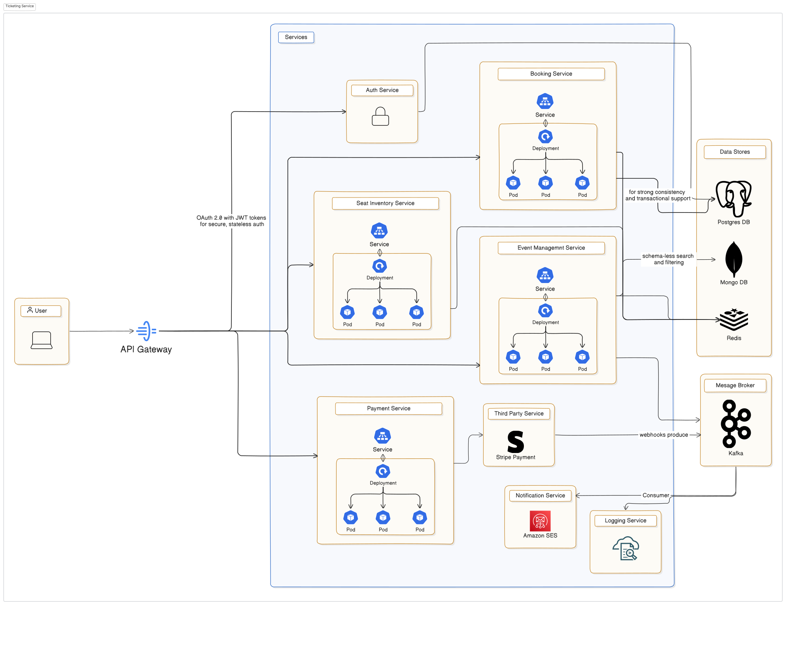

## Ticketing System

A ticketing system is an online platform that allows users to browse, book, and manage tickets for events such as concerts, sports, and travel. It must handle real-time seat availability, secure transactions, and high concurrency.

## Architecture Overview

## Functional Requirements

Users should be able to:

- Browse events and view available seats
- Book/reserve tickets
- Get real-time seat availability
- Pay for tickets securely
- Receive email/SMS confirmations
  Admins should be able to:
- Create/manage events and venues
- Define seat layouts and pricing

## Non-Functional Requirements

### High Availability (No downtime during peak sales)

- Low Latency (Booking response in milliseconds)
- Scalability (Handle flash sales, global traffic)
- Data Consistency (Avoid double booking of the same seat)
- Audit Logs (For tracking transactions and fraud prevention)

## Constraints & Challenges

- 5M total users, 100K concurrent users at peak
- Global event organizers (multi-region support)
- Handling payment failures (release locked seats quickly)

## Identifying System Bottlenecks

Concurrency in Seat Allocation:

- Race conditions while multiple users book the same seat
  Database Write Pressure
- Sudden spike in bookings can overwhelm the write DB
  Payment and External API Latency
- Delays or failures in third-party APIs can block seat availability
  Notification Backlogs
- Email/SMS confirmation systems can queue up during spikes

## Core Components Overview

The system consists of the following major components:

- Frontend Clients: Web & Mobile App
- API Gateway: Unified entry point for routing and authentication
- Authentication Service
- Admin Portal: Event creation, venue setup, pricing

## Backend Services

- Event Management Service: Manage events, venues, and seat layouts
- Seat Inventory Service: Track available/locked/booked seats
- Booking Service: Handles bookings, locking seats, confirming payments
- Payment Service: Integrates with payment gateway, handles retries
- Notification Service: Sends booking confirmations via Email/SMS

## Data & Caching Architecture

Relational DB (e.g., PostgreSQL/MySQL): For transactions, bookings,
users

- NoSQL DB (e.g., MongoDB/DocumentDB): For events and seat layouts
- Caching Layer (Redis/Memcached): Real-time seat availability
- Queue System (Kafka/RabbitMQ): Async handling for:
  - Emails
  - Payment retries
  - Audit logs

## Notable Design Decisions

- Concurrency Control: Use Optimistic Locking (version check) or Pessimistic Locking (seat-level lock)
- Seat Hold Timeout Logic: Redis-backed TTL-based lock → auto-releases after 5 minutes
- CQRS Pattern: Split reads (seat availability, listings) from writes (bookings)
- Idempotency Keys for Payments: Prevents duplicate charges and ensures safe retries

## Strategic Tech & Infra Decisions

- API Gateway: Use NGINX for self-managed or AWS API Gateway for serverless routing and rate-limiting
- Authentication: Implement OAuth 2.0 with JWT tokens for secure, stateless auth
- Booking Database: Choose PostgreSQL for strong consistency and transactional support
- Event & Venue Data: Use MongoDB or Elasticsearch for flexible, schema-less search and filtering
- Caching Layer: Integrate Redis for fast access to seat availability and temporary locks
- Async Messaging: Adopt Kafka for high-throughput event streaming and async workflows (notifications, logging)
- Payment Gateway: Integrate with Stripe or Razorpay, ensuring support for retries and webhooks
- Notifications: Use AWS SES for emails and Twilio for SMS confirmations
- Infrastructure: Deploy on Kubernetes with Auto-Scaling Groups for elasticity and resilience
- Monitoring: Leverage Prometheus and Grafana for metrics and real-time dashboards
- Logging: Use the ELK Stack (Elasticsearch, Logstash, Kibana) for centralized log aggregation and search
