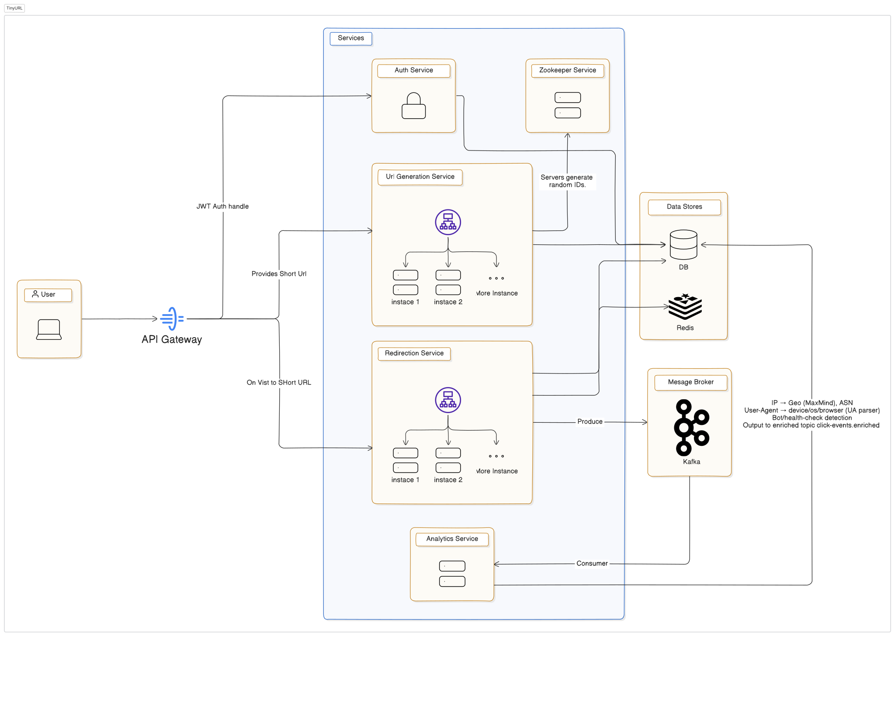
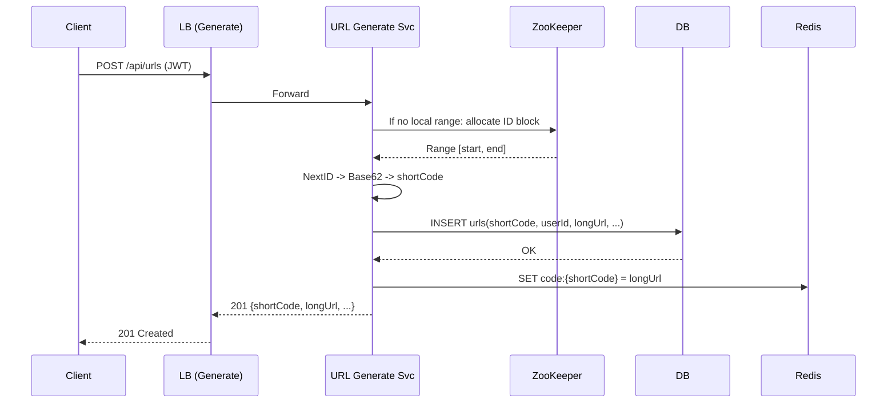
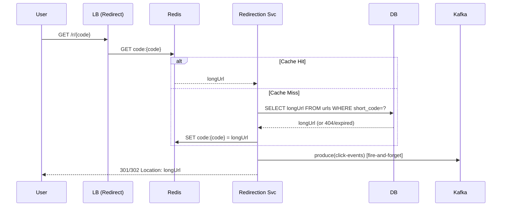

# TinyURL — System Design (README)

A production-grade, horizontally scalable URL shortener with **4 services**, **1 database**, **Redis**, **Kafka**, and **ZooKeeper**:

- **Auth Service** — JWT-based authentication & authorization
- **URL Generate Service** (behind a load balancer; horizontally scaled) — issues short codes; coordinates with **ZooKeeper** for unique ID blocks; writes to DB; warms Redis
- **Redirection Service** (behind a load balancer; horizontally scaled) — ultra-fast lookups from Redis; **fire-and-forget** click events to **Kafka**; issues 301/302
- **Analytics Service** — consumes Kafka, enriches & aggregates events; exposes analytics APIs
- **Infra** — **ZooKeeper** (ID coordination), **Kafka** (streaming), **Redis** (hot cache & counters), **DB** (metadata & durable aggregates)



## Use of ZooKeeper (ID Generation & Coordination)

**Goal:** Guarantee **globally unique**, monotonically increasing IDs for short codes **without** DB hot spots.

---

## Functional Requirements

1. **Create Short URL**

   - Authenticated users can create a short link from a long URL.
   - Options: custom alias (if available), expiration, one-time links, tags, notes.

2. **Redirect**

   - `GET /r/{code}` issues 301/302 to the original URL with **sub-10ms** app latency.
   - Handles expired/disabled links (410/404 or custom page).

3. **Analytics**

   - Real-time counters (clicks, unique IPs, referrers, countries, device types).
   - Time-series views (per minute/hour/day) with basic filters (bot/exclude-internal).

4. **Security**

   - JWT-based auth; role-based features (owner-only delete).
   - Prevent open-redirect loops & unsafe destinations (optional allowlist).

5. **Manage URLs**

   - Get/patch/delete user’s links; batch creation.

6. **Reliability**

   - Redirect should remain fast even if analytics pipeline is degraded (decoupled).

---

## Non-Functional Requirements

- **Low latency**: Redirect p99 < **30 ms** end-to-end (app), ideally served at the edge; cache hit required.
- **High throughput**: **10–50k rps** redirects sustained; **1–2k rps** URL creates.
- **Scalability**: Horizontal scale for Generate/Redirect; Kafka partitions sized for growth.
- **Availability**: 99.9%+ for redirect path; graceful degradation of analytics.
- **Consistency**: Strong for create (no duplicate codes); eventual for analytics.
- **Durability**: URL metadata in DB; analytics aggregates persisted.
- **Observability**: Traces, metrics (SLIs/SLOs), structured logs, DLQ for bad events.
- **Security/Privacy**: Rotated secrets, minimal PII, hashed IPs (salted), GDPR-aware retention.

---

## Architecture Overview

```mermaid
flowchart LR
  subgraph Clients/CDN
    U[User Browser]
    C[CDN/Edge]
  end

  U --> C

  subgraph Auth Plane
    A[Auth Service\n(JWT issuance/validation)]
  end

  subgraph Create Flow (Write Path)
    LBG[LB]
    G1[URL Generate Service]
    ZK[(ZooKeeper)]
    DB[(Relational DB)]
    R[(Redis)]
  end

  subgraph Redirect Flow (Read + Events)
    LBR[LB]
    RD1[Redirection Service]
    K[(Kafka)]
  end

  subgraph Analytics
    CONS1[Enricher Consumer]
    CONS2[Counter/Aggregate Consumer]
    R2[(Redis - Counters)]
    DB2[(DB - Aggregates)]
    AN[Analytics Service]
  end

  C -->|/auth/*| A
  C -->|/api/urls| LBG --> G1
  G1 <--> ZK
  G1 --> DB
  G1 --> R

  C -->|/r/{code}| LBR --> RD1
  RD1 -->|produce| K

  K --> CONS1 --> CONS2
  CONS2 --> R2
  CONS2 --> DB2
  AN --> R2
  AN --> DB2
```

---

## Data Model (DB: e.g., Postgres)

```sql
-- Users
CREATE TABLE users (
  id            BIGSERIAL PRIMARY KEY,
  email         CITEXT UNIQUE NOT NULL,
  password_hash TEXT NOT NULL,
  created_at    TIMESTAMPTZ NOT NULL DEFAULT now()
);

-- URLs
CREATE TABLE urls (
  id            BIGSERIAL PRIMARY KEY,
  short_code    VARCHAR(16) UNIQUE NOT NULL,   -- Base62 from ID allocator
  user_id       BIGINT REFERENCES users(id),
  long_url      TEXT NOT NULL,
  created_at    TIMESTAMPTZ NOT NULL DEFAULT now(),
  expires_at    TIMESTAMPTZ,
  is_active     BOOLEAN NOT NULL DEFAULT TRUE,
  tags          TEXT[],
  UNIQUE(short_code)
);

CREATE INDEX idx_urls_user ON urls(user_id);
CREATE INDEX idx_urls_active_expiry ON urls(is_active, expires_at);
```

**Redis keys**

- `code:{shortCode} -> longUrl` (String; TTL optional if expiring links)
- Counters: `clicks:{shortCode}:{yyyy-mm-dd}` (Hash: fields `count`, `unique_ips`, …)

---

## Kafka Contracts

- **Topic**: `click-events` (raw), key = `shortCode`
- **Topic**: `click-events.enriched` (geo/ua/device added)
- **Topic**: `click-rollups` (per-minute rollups; optional)

**Event (raw)**

```json
{
  "eventType": "CLICK",
  "version": 1,
  "eventId": "uuid-v7",
  "occurredAt": "2025-08-31T12:34:56.789Z",
  "shortCode": "Xy12Ab",
  "request": {
    "ip": "103.25.x.x",
    "userAgent": "Mozilla/5.0 ...",
    "referer": "https://twitter.com/...",
    "acceptLang": "en-IN,en;q=0.9"
  },
  "headers": { "cf-ipcountry": "IN" }
}
```

---

**Pattern: Range Allocation via ZooKeeper**

- Path: `/tinyurl/id_allocator/next` (atomic counter)
- Each **URL Generate** instance acquires a **block** (e.g., 1 million IDs) by doing an atomic increment on `next`.
- It advertises an **ephemeral** node `/tinyurl/workers/{instanceId}` with its current range.
- The service **locally** generates numeric IDs from its block; when exhausted, it requests a new block.
- Numeric ID → **Base62** → `short_code`.
- Collisions impossible (disjoint ranges); **no DB sequence contention**; minimal ZooKeeper writes.

**Why not sequential nodes per create?**

- Creates a ZooKeeper bottleneck under high write QPS. Range allocation reduces ZK traffic by \~1e6x (per block).

**Bonus uses:**

- **Leader election** (optional) for background tasks.
- **Health/Liveness** via ephemeral znodes for quick ops visibility.

---

## Use of Kafka (Decoupled Analytics)

**Why:** Keep redirect path ultra-fast. Analytics is **asynchronous** and **eventually consistent**.

- **Producer:** Redirection Service (hot path)

  - Non-blocking, batched (`linger.ms=5–10`), compression (`zstd`/`lz4`), idempotent producer on, `acks=1` or `all` depending on durability vs latency.

- **Consumers:**

  1. **Enricher** → IP→Geo, UA→Device; outputs to `click-events.enriched`
  2. **Aggregator** → updates Redis counters; periodically flushes aggregates to DB
  3. **DLQ handler** → retries & quarantine

**Partitioning:**

- Key = `shortCode` → per-code ordering; start with **48–96 partitions** (scale with traffic).

---

## Request Flows

### 1) Create Short URL (Write Path)



### 2) Redirect (Read + Event)



---

## API Design

### Auth Service

**POST `/auth/login`**
Request:

```json
{ "email": "user@example.com", "password": "••••••••" }
```

Response:

```json
{ "accessToken": "jwt", "refreshToken": "jwt", "expiresIn": 3600 }
```

**POST `/auth/refresh`**
Request:

```json
{ "refreshToken": "jwt" }
```

Response:

```json
{ "accessToken": "jwt", "expiresIn": 3600 }
```

---

### URL Generate Service (JWT required)

**POST `/api/urls`** — create short URL
Request:

```json
{
  "longUrl": "https://example.com/product/123?ref=tw",
  "customAlias": "sale2025", // optional
  "expiresAt": "2025-12-31T23:59:59Z", // optional
  "tags": ["campaign", "black-friday"]
}
```

Response:

```json
{
  "shortCode": "Xy12Ab",
  "shortUrl": "https://t.example.com/r/Xy12Ab",
  "longUrl": "https://example.com/product/123?ref=tw",
  "expiresAt": "2025-12-31T23:59:59Z",
  "createdAt": "2025-08-31T12:00:00Z"
}
```

**GET `/api/urls/{code}`** — fetch metadata
Response:

```json
{
  "shortCode": "Xy12Ab",
  "longUrl": "https://example.com/product/123?ref=tw",
  "isActive": true,
  "expiresAt": null,
  "tags": ["campaign"]
}
```

**DELETE `/api/urls/{code}`** — soft delete (disable)
Response:

```json
{ "deleted": true }
```

**POST `/api/urls:batch`** — create up to N in one call
Request:

```json
{ "items": [{ "longUrl": "https://a.com" }, { "longUrl": "https://b.com" }] }
```

Response:

```json
{
  "items": [{ "shortCode": "Ab12", "status": "OK" }, { "error": "invalid_url" }]
}
```

---

### Redirection Service (public)

**GET `/r/{code}`** → 301/302

- 404 if not found, 410 if expired/disabled.
- **No** analytics processing inline (only produce to Kafka).

**HEAD `/r/{code}`** → existence check (optional; 200/404/410)

---

### Analytics Service

**GET `/analytics/{code}/summary?from=...&to=...&bots=exclude`**
Response:

```json
{
  "code": "Xy12Ab",
  "totalClicks": 120345,
  "uniqueIps": 80211,
  "topReferrers": [{ "referrer": "twitter.com", "count": 45678 }],
  "countries": [
    { "country": "IN", "count": 70211 },
    { "country": "US", "count": 13002 }
  ],
  "devices": [
    { "device": "mobile", "count": 78000 },
    { "device": "desktop", "count": 42345 }
  ]
}
```

**GET `/analytics/{code}/timeseries?granularity=day&from=...&to=...`**
Response:

```json
{
  "granularity": "day",
  "points": [
    { "ts": "2025-08-25", "clicks": 20123 },
    { "ts": "2025-08-26", "clicks": 22110 }
  ]
}
```

- DB write QPS \~1k (INSERT + index). With p99 < 20 ms easily achievable on managed Postgres with proper tuning.

### Bottlenecks & Remedies

| Area                  | Risk                                      | Mitigation                                                         |
| --------------------- | ----------------------------------------- | ------------------------------------------------------------------ |
| **DB hot writes**     | Custom alias collisions; index contention | Pre-check alias in Redis; deferred constraints; retry with backoff |
| **ZooKeeper**         | Per-create calls overload                 | **Range allocation** (1e6 IDs per block); ephemeral worker nodes   |
| **Redis**             | Memory pressure; evictions                | Key TTL policy; LFU; cluster mode; compress long URLs (optional)   |
| **Kafka**             | Partition imbalance; broker I/O           | Key by `shortCode`; adequate partitions; compression; monitor ISR  |
| **Redirect latency**  | Cache miss → DB                           | High hit ratio via prewarm; write-through on create; edge caches   |
| **Consumer lag**      | Spikes during bursts                      | Horizontal scale consumers; idempotent logic; DLQ + replay         |
| **Geo/UA enrichment** | Slow lookups                              | Local MaxMind DB, in-process parsers; batch/warm caches            |

---

## Performance & Reliability Patterns

- **Redirect path:** cache lookup + Kafka produce + 302 ⇒ **no DB writes**.
- **Fire-and-forget** produce: app shouldn’t block on `acks=all`. Prefer buffered producer; if Kafka unavailable, **fallback** to Redis Stream/WAL and drain later.
- **Idempotency:** include `eventId` (UUIDv7); consumers dedupe per `(shortCode,eventId)`.
- **Counters:** update Redis immediately; flush aggregated rows to DB every N seconds/minutes (upsert).
- **Edge**: Put `/r/{code}` on CDN/Workers. Use KV at edge for hottest mappings.
- **Rate limiting:** per user for create endpoints; per IP for abusive redirect traffic.

---

## Security Considerations

- **JWT**: short-lived access tokens; rotate signing keys; audience/issuer claims checked.
- **URL validation**: disallow dangerous schemes; optional allowlist/denylist; prevent loops to `*.tinyurl.*`.
- **PII minimization**: hash IP with rotatable salt; configurable retention windows.
- **Abuse detection**: rate spikes, headless UAs, data center IPs → flag & optionally throttle.

---
